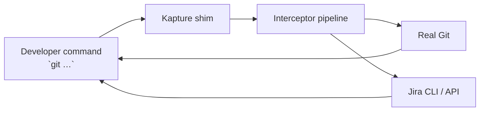

# Kapture

**Kapture keeps engineers shipping while your Jira data stays trustworthy.** It wraps the real `git` binary so every
commit, branch, and pull request quietly applies Jira policy, updates ticket state, and captures the context your
workflow depends on—without asking developers to learn a new tool.

## Why teams adopt Kapture

- **Hands-free governance** – Branch names, ticket states, and review gates stay compliant without extra clicks.
- **Faster delivery loops** – Developers remain in the Git CLI they already trust; Jira updates run in the background.
- **Auditable automation** – Configurable interceptors give you a transparent paper trail for policy decisions.
- **Instant trialability** – Native binaries and a ready-to-run Docker stack make evaluation frictionless for local and CI.

## What you get in the box

- Drop-in Git shim with policy-aware pre/post hooks.
- Native git workflow commands: `git subtask`, `git review`, `git merge`, `git work` (no prefix required).
- Automatic commit message enrichment with ticket keys.
- Pluggable integration layer (Jira CLI today, REST adapters tomorrow).
- Build tooling for JVM, GraalVM native images, and reproducible smoke environments.

## Try it in five minutes

1. Install the native binary: `./scripts/install.sh --force` *(or build locally via `./gradlew :cli:nativeCompile`).*
2. Point Kapture at your Jira domain and branch conventions — see
   [`docs/configuration.md`](docs/configuration.md) for a minimal config template.
3. Confirm the shim is active: `git status` (Kapture info is appended to git's output).

### Makefile quick reference

Common flows are exposed via `make`:

```bash
make help        # List available targets
make test        # Run the JVM test suite (./gradlew test)
make cli-test    # Module-specific tests (:cli:test, :core:test, ...)
make native      # Build the native CLI binary
```

## How it works



Kapture resolves the real Git binary, evaluates each registered interceptor (branch policy, Jira status gates, commit enrichment),
then delegates to Git. Interceptors can short-circuit execution or post-process results. Custom workflow commands bypass
git entirely and orchestrate Jira + GitHub operations directly. Deep dive in [`docs/architecture.md`](docs/architecture.md).

## Core workflows

All commands work directly as git subcommands:

- `git subtask <PARENT-ID> <title>` – Create a Jira subtask under parent and transition to In Progress.
- `git subtask <SUBTASK-ID>` – Transition an existing subtask to In Progress.
- `git start <TASK-ID> [--branch/-B <name>]` – Create a branch (auto-named from task title) and transition to In Progress.
- `git review [<optional-title>]` – Create a pull request with Jira context and transition to Code Review.
- `git merge [<subtask-id>] [--close-parent]` – Merge PR, close subtask, and optionally close parent story.
- `git work` – Display work log, commits, and PR status for current branch.
- `git commit -m "message"` – Automatically prefixed with ticket key (e.g., `"KAP-123: message"`).

Explore the full lifecycle (including status transitions, sample outputs, and failure modes) in
[`docs/workflow-automation.md`](docs/workflow-automation.md).

## Configure it your way

```json
{
  "externalBaseUrl": "https://jira.example.com",
  "branchPattern": "^(?<task>[A-Z]+-\\d+)/[a-z0-9._-]+$",
  "enforcement": {
    "branchPolicy": "WARN",
    "statusCheck": "OFF"
  },
  "external": {
    "type": "jiraCli",
    "environment": {
      "JIRA_USER_EMAIL": "dev@example.com",
      "JIRA_API_TOKEN": "<token>"
    }
  }
}
```

Override the config file location with:
- Command-line flags: `git -k /path/to/config.json <command>` or `git --konfig=/path/to/config.json <command>`
- Environment variable: `KAPTURE_CONFIG=/path/to/config.json`
- Real Git binary hint: `REAL_GIT=/usr/local/bin/git`

Configuration keys and operator tips live in [`docs/configuration.md`](docs/configuration.md).

## Resources

- [`docs/workflow-automation.md`](docs/workflow-automation.md) – command walkthroughs and Jira status flow.
- [`docs/configuration.md`](docs/configuration.md) – config schema, environment variables, and presets.
- [`docs/architecture.md`](docs/architecture.md) – module layout, interceptor lifecycle, extension guide.

Questions or ideas? Open an issue or start a discussion—we iterate quickly when feedback is actionable.
