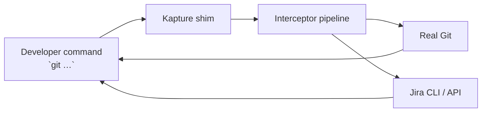

# Kapture

**Kapture keeps engineers shipping while your Jira data stays trustworthy.** It wraps the real `git` binary so every
commit, branch, and pull request quietly applies Jira policy, updates ticket state, and captures the context your
workflow depends on—without asking developers to learn a new tool.

## Why teams adopt Kapture

- **Hands-free governance** – Branch names, ticket states, and review gates stay compliant without extra clicks.
- **Faster delivery loops** – Developers remain in the Git CLI they already trust; Jira updates run in the background.
- **Auditable automation** – Configurable interceptors give you a transparent paper trail for policy decisions.
- **Instant trialability** – Native binaries and a ready-to-run Docker stack make evaluation frictionless for local and CI.

## What you get in the box

- Drop-in Git shim with policy-aware pre/post hooks.
- Jira workflow automation commands (`git kapture subtask|branch|review|merge`).
- Pluggable integration layer (Jira CLI today, REST adapters tomorrow).
- Build tooling for JVM, GraalVM native images, and reproducible smoke environments.

## Try it in five minutes

1. Install the native binary: `./scripts/install.sh --force` *(or build locally via `./gradlew :cli:nativeCompile`).*
2. Point Kapture at your Jira domain and branch conventions — see
   [`docs/configuration.md`](docs/configuration.md) for a minimal config template.
3. Confirm the shim is active: `git kapture status` (prints resolved Git path and active interceptors).

<details>
<summary>Prefer containers?</summary>

```bash
# Boot the lightweight Jira mock server
docker compose -f virtualization/stack/docker-compose.yml up -d

# Run the smoke harness against the mock
./scripts/integration-test.sh
```

Shut everything down with `docker compose -f virtualization/stack/docker-compose.yml down --remove-orphans`. See
[`scripts/integration-test.sh`](scripts/integration-test.sh) for a fully automated validation flow usable in CI.

</details>

### Makefile quick reference

Common flows are exposed via `make`:

```bash
make help        # List available targets
make test        # Run the JVM test suite (./gradlew test)
make cli-test    # Module-specific tests (:cli:test, :core:test, ...)
make native      # Build the native CLI binary
make integration # Execute scripts/integration-test.sh
make mock-up     # Start the Jira mock docker compose stack
make mock-down   # Stop the mock stack
```

### Recording-friendly playground

Want a guided terminal session you can screen-record? Bring up the demo container (Docker required):

```bash
# Set a real Jira story key so the walkthrough has something to attach to
export PLAYGROUND_PARENT_KEY=PROJ-123

# Build the image and launch the scripted walkthrough
./scripts/playground-demo.sh
```

The container seeds a repo, runs `git kapture subtask|branch|review|merge`, and then drops you into an interactive shell
for retakes. Use `PLAYGROUND_SKIP_GH=true` to skip the review/merge steps when GitHub CLI is unavailable, or pass
`--skip-demo` / `--no-shell` flags to customise the flow. Review the script in
[`playground/demo-script.sh`](playground/demo-script.sh) to see the exact sequence.

## How it works



Kapture resolves the real Git binary, evaluates each registered interceptor (branch policy, Jira status gates, telemetry),
then delegates to Git. Interceptors can short-circuit execution or post-process results. Deep dive in
[`docs/architecture.md`](docs/architecture.md).

## Core workflows

- `git kapture subtask` – create Jira subtasks with guard rails.
- `git kapture branch` – enforce branch patterns and start work-in-progress transitions.
- `git kapture review` – raise pull requests pre-populated with ticket context.
- `git kapture merge` – complete the loop with status updates and branch cleanup.

Explore the full lifecycle (including status transitions, sample outputs, and failure modes) in
[`docs/workflow-automation.md`](docs/workflow-automation.md).

## Configure it your way

```json
{
  "externalBaseUrl": "https://jira.example.com",
  "branchPattern": "^(?<task>[A-Z]+-\\d+)/[a-z0-9._-]+$",
  "enforcement": {
    "branchPolicy": "WARN",
    "statusCheck": "OFF"
  },
  "external": {
    "type": "jiraCli",
    "environment": {
      "JIRA_USER_EMAIL": "dev@example.com",
      "JIRA_API_TOKEN": "<token>"
    }
  }
}
```

Override the file path with `KAPTURE_CONFIG`, or hint the real Git binary using `REAL_GIT`. Configuration keys and
operator tips live in [`docs/configuration.md`](docs/configuration.md).

## Resources

- [`docs/workflow-automation.md`](docs/workflow-automation.md) – command walkthroughs and Jira status flow.
- [`docs/configuration.md`](docs/configuration.md) – config schema, environment variables, and presets.
- [`docs/architecture.md`](docs/architecture.md) – module layout, interceptor lifecycle, extension guide.
- [`scripts/integration-test.sh`](scripts/integration-test.sh) – end-to-end smoke tests that mix Docker and native runs.
- [`virtualization/jira/README.md`](virtualization/jira/README.md) – JSON-backed Jira mock used in tests.

Questions or ideas? Open an issue or start a discussion—we iterate quickly when feedback is actionable.
