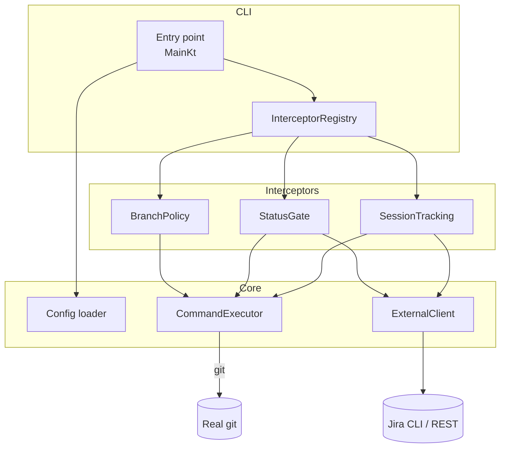

# Architecture

Kapture is split into composable modules so policy checks, external integrations, and build targets can evolve
independently. This guide orients you around the moving parts and shows how a single Git command flows through the
system.

## TL;DR

- `core` owns shared primitives: configuration loading, process execution, logging, and the external client facade.
- `interceptors` contribute policy hooks that run before/after Git executes.
- `cli` wires everything together, resolves the real Git binary, and is the only module that produces runnable artefacts.
- `virtualization/jira` contains the JSON-backed Jira mock used in integration tests and local smoke runs.

## System map



Each interceptor depends only on `core` types and is registered declaratively inside `Registry`. The CLI orchestrates
order; the core module supplies the runtime services they rely on.

## Module responsibilities

<details>
<summary><code>core</code></summary>

- Loads configuration (`Config.load`) with precedence: explicit path → `KAPTURE_CONFIG` → default state directory.
- Resolves the real Git binary via `RealGitResolver`, filtering out the wrapper itself.
- Provides `CommandExecutor` helpers for passthrough and captured execution.
- Hosts the `ExternalClient` abstraction that normalises task status queries and telemetry submission across adapters.

</details>

<details>
<summary><code>interceptors</code></summary>

- Define the `GitInterceptor` contract (`before`/`after` hooks).
- Ship built-in implementations:
  - `BranchPolicyInterceptor` – validates branch names against the configured regex.
  - `StatusGateInterceptor` – checks ticket state before critical commands.
  - `SessionTrackingInterceptor` – emits activity snapshots when enabled.
- Register interceptors in processing order via `InterceptorRegistry.interceptors`.

</details>

<details>
<summary><code>cli</code></summary>

- Parses the incoming Git invocation and decides whether to call a built-in subcommand (`git kapture …`) or forward to
  the interceptor loop.
- Applies fast paths for read-only commands (e.g. `--version`, completions) to keep Git UX snappy.
- Exposes build artefacts: Kotlin/JVM application, GraalVM native image, and Docker entrypoints.

</details>

## Invocation lifecycle

1. `MainKt.main` receives the raw Git arguments.
2. `Config.load` resolves settings and materialises the state directory if needed.
3. `RealGitResolver` searches `REAL_GIT`, config hints, and `PATH`, stopping once it finds a binary that is not the
   wrapper itself.
4. The CLI decides which path to take:
   - built-in commands (`git kapture status`, `--list-cmds`) run immediately;
   - completion helpers and other read-only Git commands bypass interceptors;
   - everything else becomes an `Invocation` that flows through the interceptor pipeline.
5. Each interceptor’s `before` hook runs in order and may short-circuit by returning a non-null exit code.
6. If execution proceeds, `CommandExecutor.passthrough` spawns the real Git process with untouched environment and
   working directory.
7. After Git exits, `after` hooks run in the same order (session tracking, post-run messaging, …).
8. The CLI returns Git’s exit code to the caller.

## External integrations

`ExternalClient` exposes two composable operations to interceptors:

- `getTaskStatus(taskId)` – fetches ticket state from Jira (via `jira-cli` or REST).
- `trackSession(snapshot)` – forwards telemetry events when tracking is enabled.

Adapters handle retries, logging, and command execution. When integrations fail, interceptors degrade gracefully and
allow Git to continue, logging diagnostics behind `KAPTURE_DEBUG`.

## Native image build pipeline

The CLI module uses `org.graalvm.buildtools.native` and enables optimisation flags tuned for CI and local runs:

```kotlin
buildArgs.addAll(
    "--pgo", "--strict-image-heap",
    "-R:MaxHeapSize=512m", "-march=native", "-Ob"
)
```

Relevant Gradle tasks:

- `:cli:nativeCompile` – build the optimised native binary.
- `:cli:nativeRun` – execute the binary directly from the build output.
- `:cli:nativeTest` – run JVM tests against the native runtime (when supplied).

## Extending the pipeline

1. Implement `GitInterceptor`, returning a non-null exit code from `before` when you need to block execution.
2. Register your interceptor inside `InterceptorRegistry.interceptors`, paying attention to ordering.
3. Document any new configuration keys in [`docs/configuration.md`](configuration.md) and add tests under the relevant
   module.
4. Keep shared utilities in `core` so other interceptors can reuse them without creating new dependencies.

Use the [`scripts/integration-test.sh`](../scripts/integration-test.sh) suite to validate behaviour across Docker and
native executions after introducing new hooks.
