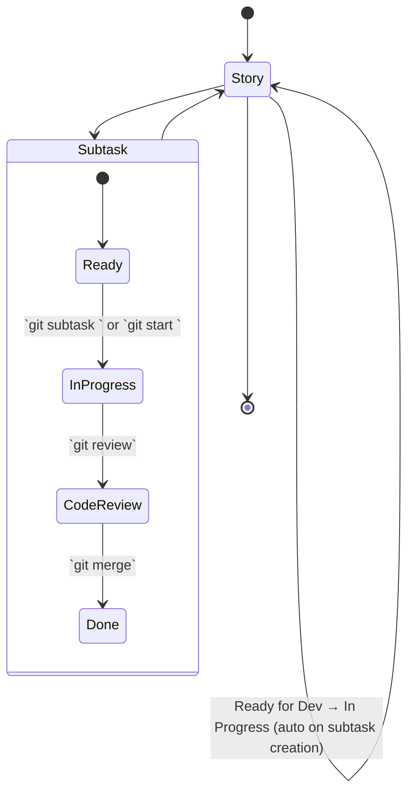

# Workflow automation

Kapture packages your Jira workflow into native Git commands so ticket creation, status transitions, and pull-request
hygiene happen on autopilot. All commands work directly as `git <command>`. This page walks through the lifecycle,
prerequisites, and what to expect from each command.

## End-to-end flow



## Prerequisites

- Kapture installed (native binary recommended). See the [Quick Start](../README.md#try-it-in-five-minutes).
- `jira-cli` configured with credentials and server URL — follow the template in
  [`docs/configuration.md`](configuration.md#external-integrations).
- GitHub CLI (`gh`) authenticated if you use the review/merge helpers.

<details>
<summary>Sanity checks before you begin</summary>

```bash
# Confirm the shim is active (Kapture info appears after git's output)
git status
# Ensure Jira CLI is reachable
jira version
# Authenticate GitHub CLI if needed
gh auth status
```

</details>

## Happy path in 90 seconds

```bash
# Create a subtask under STORY-123 and transition it to In Progress
git subtask STORY-123 "Reset password"
# Output: ✓ Created subtask: STORY-456
#         ✓ Subtask STORY-456 → In Progress

# Start work on the subtask (creates branch from task title)
git start STORY-456
# Output: Creating branch: STORY-456/reset-password
#         ✓ Branch created: STORY-456/reset-password
#         ✓ Task STORY-456 → In Progress

# Or specify custom branch name
git start STORY-456 --branch feature/custom-name

# Make commits (ticket key is automatically prepended)
git commit -m "Add password validation"
# Actual message: "STORY-456: Add password validation"

# Check your work log
git work
# Shows task details, commits, branch status, and PR info

# After coding, open a PR and transition to Code Review
git review
# Or with custom title:
git review "Custom PR Title"
# Output: ✓ Pull request created
#         ✓ Subtask STORY-456 → Code Review

# Merge the PR and close the ticket
git merge
# Or merge and close the parent story:
git merge --close-parent
# Output: ✓ Pull request merged
#         ✓ Subtask STORY-456 → Closed
#         ✓ Parent story STORY-123 → Closed
```

Each command prints clear ✓ / ✗ feedback and exits with Git-compatible status codes so your workflows stay scriptable.

## Command reference

| Command                                  | Prerequisites                                                       | Outcome                                                                      |
|------------------------------------------|---------------------------------------------------------------------|-----------------------------------------------------------------------------|
| `git subtask <PARENT> <title>`           | Parent ticket in an allowed state                                   | Creates a Jira subtask, links to parent, transitions to *In Progress*.      |
| `git subtask <SUBTASK-ID>`               | Subtask exists                                                      | Transitions the subtask to *In Progress*.                                   |
| `git start <TASK-ID> [--branch/-B <name>]` | Task exists and in allowed state                                 | Creates branch (auto-named from title), transitions to *In Progress*.      |
| `git review [<optional-title>]`          | Clean working tree, branch contains `task`, `gh` authenticated      | Pushes branch, opens PR with Jira context, moves to *Code Review*.         |
| `git merge [<id>] [--close-parent]`      | PR open for branch, ticket in *Code Review*                         | Merges PR (squash), transitions ticket to *Done*, optionally closes parent. |
| `git work`                               | Branch contains `task` matching `branchPattern`                     | Displays work log, commits, branch status, and PR information.              |
| `git commit -m "msg"`                    | Branch contains `task` matching `branchPattern`                     | Automatically prepends ticket key to commit message.                        |

<details>
<summary><code>git subtask</code></summary>

**Mode 1: Create subtask**
```bash
$ git subtask STORY-123 "Reset password"
Creating subtask under parent STORY-123...
✓ Created subtask: STORY-456
  Parent: STORY-123
Transitioning STORY-456 to 'In Progress'...
✓ Subtask STORY-456 → In Progress
```

**Mode 2: Transition existing subtask**
```bash
$ git subtask STORY-456
Transitioning STORY-456 to 'In Progress'...
✓ Subtask STORY-456 → In Progress
```

- Validates the parent/subtask ticket status before actions.
- Returns the subtask key on stdout so you can export it in scripts.
- Dual-mode behavior detected by presence of title argument.

</details>

<details>
<summary><code>git start</code></summary>

**Auto-named from task title**
```bash
$ git start STORY-456
Creating branch: STORY-456/reset-password-validation
Transitioning STORY-456 to 'In Progress'...
✓ Branch created: STORY-456/reset-password-validation
✓ Task STORY-456 → In Progress
```

**With custom branch name**
```bash
$ git start STORY-456 --branch feature/custom-name
Creating branch: feature/custom-name
Transitioning STORY-456 to 'In Progress'...
✓ Branch created: feature/custom-name
✓ Task STORY-456 → In Progress
```

- Auto-generates branch name from task title (lowercase, alphanumeric, max 50 chars).
- Use `--branch` or `-B` to specify custom branch name.
- Validates task exists and is in allowed state before creating branch.
- Leaves the new branch checked out and ready for commits.

</details>

<details>
<summary><code>git review</code></summary>

**Default (uses Jira summary as PR title)**
```bash
$ git review
Pushing branch to remote...
Creating pull request...
Transitioning STORY-456 to 'Code Review'...
✓ Pull request created
✓ Subtask STORY-456 → Code Review
```

**With custom title**
```bash
$ git review "Fix critical password validation bug"
Pushing branch to remote...
Creating pull request...
Transitioning STORY-456 to 'Code Review'...
✓ Pull request created
✓ Subtask STORY-456 → Code Review
```

- Uses GitHub CLI under the hood; customise templates via `.github/PULL_REQUEST_TEMPLATE`.
- Attaches Jira metadata as collapsible sections in the PR body.
- Custom title parameter overrides Jira task summary.

</details>

<details>
<summary><code>git merge</code></summary>

**Basic merge (from current branch)**
```bash
$ git merge
Merging pull request...
Transitioning STORY-456 to 'Closed'...
✓ Pull request merged
✓ Subtask STORY-456 → Closed
```

**Merge specific subtask with parent closure**
```bash
$ git merge STORY-456 --close-parent
Merging pull request...
Transitioning STORY-456 to 'Closed'...
✓ Pull request merged
✓ Subtask STORY-456 → Closed

Checking parent story STORY-123...
✓ Parent story STORY-123 → Closed
```

- Performs a squash merge and deletes the remote branch when possible.
- `--close-parent` flag transitions parent story to Done after subtask closure.
- Can specify subtask ID explicitly or infer from current branch.
- Emits a warning rather than failing if Jira transitions are rejected.

</details>

<details>
<summary><code>git work</code></summary>

```bash
$ git work
━━━━━━━━━━━━━━━━━━━━━━━━━━━━━━━━━━━━━━━━
Work Log for STORY-456
━━━━━━━━━━━━━━━━━━━━━━━━━━━━━━━━━━━━━━━━

Task: Add password reset functionality
Status: In Progress
Parent: STORY-123

Recent Commits:
━━━━━━━━━━━━━━━━━━━━━━━━━━━━━━━━━━━━━━━━
a1b2c3d STORY-456: Add validation logic
e4f5g6h STORY-456: Update tests
i7j8k9l STORY-456: Fix edge cases

Branch Status:
━━━━━━━━━━━━━━━━━━━━━━━━━━━━━━━━━━━━━━━━
M  src/auth/password.ts
A  tests/password.spec.ts

Pull Request:
━━━━━━━━━━━━━━━━━━━━━━━━━━━━━━━━━━━━━━━━
No pull request found for this branch
```

- Extracts task ID from current branch name.
- Displays comprehensive work context in one view.
- Shows last 10 commits, working tree status, and associated PR.
- Useful for status updates and handoffs.

</details>

<details>
<summary><code>git commit</code> (automatic enrichment)</summary>

```bash
# Your command
$ git commit -m "Add password validation"

# What actually gets committed
# Message: "STORY-456: Add password validation"
```

- Automatically prepends ticket key from current branch.
- Only modifies message if ticket key is not already present.
- Works with `-m`, `--message`, `-m=` formats.
- Ticket key extracted using configured `branchPattern`.

</details>

## Failure signals

- **Branch validation** – mismatched names return exit code `1` before Git runs; fix the branch or adjust
  [`branchPattern`](configuration.md#branch-pattern--naming).
- **Status gates** – disallowed ticket states produce a red ✗ with the required status listed.
- **External outages** – Jira CLI failures log diagnostics (enable `KAPTURE_DEBUG=1`) but do not corrupt your Git repo.

### Temporarily skipping enforcement

- Append `-nk` or `--no-kapture` to any git command to bypass all interceptors for that invocation.
- Set `KAPTURE_OPTOUT=1` in CI or shell sessions when you need a broader exemption. The shim strips opt-out flags before
  delegating to Git, so the underlying command never sees them.

## Testing the workflow

- Local validation: Configure Jira credentials and run workflow commands against your test environment.
- Verify interceptors: Run `git status` and check the Kapture section appended to git's output.

## Limitations & roadmap

- The REST adapter currently offers status lookups only; workflow commands require `jira-cli`.
- Status names are case-sensitive and must match your Jira workflow exactly.
- Related pull requests section in the PR body is informational; extend `WorkflowCommands` if you need automation there.

Contributions and extension ideas are welcome—see [`docs/architecture.md`](architecture.md#extending-the-pipeline) for the
mechanics of adding new interceptors or automation steps.
