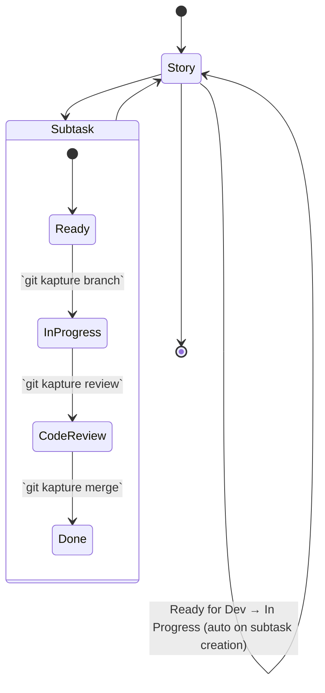

# Workflow automation

Kapture packages your Jira workflow into familiar Git commands so ticket creation, status transitions, and pull-request
hygiene happen on autopilot. This page walks through the lifecycle, prerequisites, and what to expect from each command.

## End-to-end flow



## Prerequisites

- Kapture installed (native binary recommended). See the [Quick Start](../README.md#try-it-in-five-minutes).
- `jira-cli` configured with credentials and server URL — follow the template in
  [`docs/configuration.md`](configuration.md#external-integrations).
- GitHub CLI (`gh`) authenticated if you use the review/merge helpers.

<details>
<summary>Sanity checks before you begin</summary>

```bash
# Confirm the shim resolves Git correctly
git kapture status
# Ensure Jira CLI is reachable
jira version
# Authenticate GitHub CLI if needed
gh auth status
```

</details>

## Happy path in 90 seconds

```bash
# Create a subtask under STORY-123
git kapture subtask STORY-123 "Reset password"

# Start a feature branch and move the ticket to In Progress
git kapture branch STORY-456

# After coding, open a PR and transition to Code Review
git kapture review

# Merge the PR, close the ticket, and clean up the branch
git kapture merge
```

Each command prints clear ✓ / ✗ feedback and exits with Git-compatible status codes so your workflows stay scriptable.

## Command reference

| Command                 | Prerequisites                                                       | Outcome                                                                      |
|-------------------------|---------------------------------------------------------------------|-----------------------------------------------------------------------------|
| `git kapture subtask`   | Parent ticket in an allowed state                                   | Creates a Jira subtask and links it to the parent.                          |
| `git kapture branch`    | Subtask exists and matches `branchPattern`                          | Checks out `TASK-123/slug`, transitions the subtask to *In Progress*.       |
| `git kapture review`    | Clean working tree, branch contains `task`, `gh` authenticated      | Pushes branch, opens PR populated with Jira context, moves to *Code Review*.|
| `git kapture merge`     | PR open for branch, ticket already in *Code Review*                 | Merges PR (squash by default), transitions ticket to *Done*, updates branch.|

<details>
<summary><code>git kapture subtask</code></summary>

```bash
$ git kapture subtask STORY-123 "Reset password"
✓ Created subtask: STORY-456
```

- Validates the parent ticket status before creation.
- Returns the new subtask key on stdout so you can export it in scripts.

</details>

<details>
<summary><code>git kapture branch</code></summary>

```bash
$ git kapture branch STORY-456
✓ Branch created: STORY-456/dev
✓ Subtask STORY-456 → In Progress
```

- Enforces your configured `branchPattern`.
- Leaves the new branch checked out and ready for commits.

</details>

<details>
<summary><code>git kapture review</code></summary>

```bash
$ git kapture review
✓ Pull request created
✓ Subtask STORY-456 → Code Review
```

- Uses GitHub CLI under the hood; customise templates via `.github/PULL_REQUEST_TEMPLATE`. 
- Attaches Jira metadata as collapsible sections in the PR body.

</details>

<details>
<summary><code>git kapture merge</code></summary>

```bash
$ git kapture merge
✓ Pull request merged
✓ Subtask STORY-456 → Done
```

- Performs a squash merge and deletes the remote branch when possible.
- Emits a warning rather than failing if Jira transitions are rejected.

</details>

## Failure signals

- **Branch validation** – mismatched names return exit code `1` before Git runs; fix the branch or adjust
  [`branchPattern`](configuration.md#branch-pattern--naming).
- **Status gates** – disallowed ticket states produce a red ✗ with the required status listed.
- **External outages** – Jira CLI failures log diagnostics (enable `KAPTURE_DEBUG=1`) but do not corrupt your Git repo.

## Smoke testing the workflow

- Local validation: `docker compose up -d postgres jira` then run `scripts/integration-test.sh` to exercise the stack.
- CI pipelines: reuse the integration script; it boots the docker-compose stack, waits for health checks, runs
  native-wrapper regression tests, and tears everything down.

## Limitations & roadmap

- The REST adapter currently offers status lookups only; workflow commands require `jira-cli`.
- Status names are case-sensitive and must match your Jira workflow exactly.
- Related pull requests section in the PR body is informational; extend `WorkflowCommands` if you need automation there.

Contributions and extension ideas are welcome—see [`docs/architecture.md`](architecture.md#extending-the-pipeline) for the
mechanics of adding new interceptors or automation steps.
